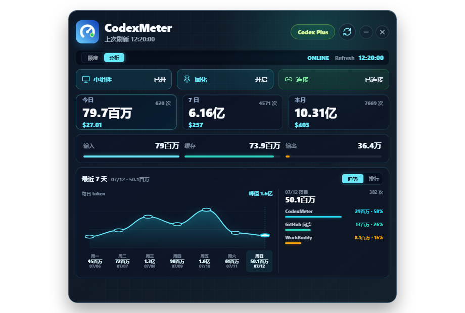
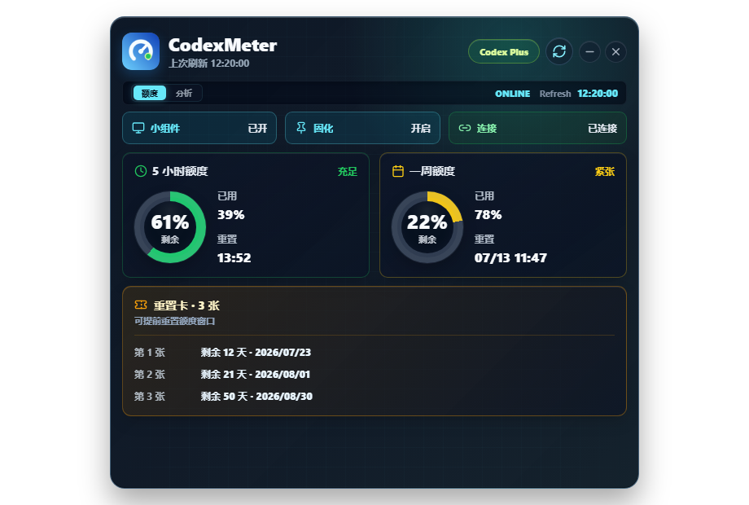

# CodexMeter

CodexMeter 是一个跨平台 Codex 用量监控服务。云端网页负责多设备汇总和分析，Windows 桌面端提供额度与悬浮球，macOS 轻量采集器在后台读取本机 Codex 日志并安全同步。

> 当前仓库是基于 `MrWanCC/CodexMeter` 的本地改造版本，保留原项目的非商业许可边界。

## 当前能力

- Codex OAuth 授权状态与额度读取
- 5 小时额度、7 天额度、重置时间与重置卡展示
- 轻量悬浮球小组件，支持悬停详情与双击打开主界面
- 本机 token 分析页：
  - 今日 / 7 日 / 本月 token
  - input / cached input / output 拆分
  - workspace / thread 项目排行
  - 工具与 Skill Top
  - 今日任务看板
  - API 等效价值粗估
- ESP32-C3 小屏硬件显示方案，支持 BLE / HTTP 推送
- 云端多设备看板：每日曲线、Windows/macOS 贡献率、官方总量与本地覆盖率
- 匿名事件指纹跨设备去重，同一账号官方日桶只计一次
- 一次性 8 位配对码，新设备使用独立凭据加入同步空间
- macOS Intel / Apple Silicon 轻量后台采集器，支持 Keychain 与开机运行
- 本地安全存储授权信息，不主动发起模型请求

云端看板：[CodexMeter Cloud](https://codexmeter-cloud-929656937.netlify.app)

## macOS 测试

GitHub Actions 会生成两份轻量采集器：

- `CodexMeter-Agent-macOS-arm64.zip`：Apple Silicon（M1/M2/M3/M4 等）
- `CodexMeter-Agent-macOS-x64.zip`：Intel Mac

使用流程：

1. 在已连接云端的 Windows CodexMeter 中打开“云端”，点击多设备配对区的“生成”。
2. Mac 解压对应架构的 ZIP，右键打开 `Install CodexMeter Agent.command`。
3. 输入 8 位配对码。安装器会完成首次同步，并注册每 5 分钟运行的 `launchd` 服务。
4. 双击 `Open Dashboard.command` 可打开网页看板；不用时运行 `Uninstall CodexMeter Agent.command`。

同步凭据保存在 macOS Keychain。采集器不会上传提示词、回复、项目路径、文件内容、OAuth 或原始线程 ID。

## 项目截图

### Token 分析



### 额度总览

<p align="center">
  
</p>

### 轻量悬浮球

<p align="center">
  
</p>

## 本地开发

环境要求：

- Node.js 20+
- pnpm
- Windows 10/11；Mac 采集器由 GitHub Actions 在 macOS 构建

```powershell
pnpm install
pnpm dev
```

常用命令：

```powershell
pnpm test
pnpm build
pnpm dist:portable
pnpm agent:build
```

构建产物默认输出到 `dist/`、`dist-electron/` 和 `release/`，这些目录不会提交到 Git。

## 项目结构

```text
src/
  main/       Electron 主进程、OAuth、额度读取、usage provider
  preload/    安全暴露给渲染进程的 IPC 接口
  renderer/   Vue 页面、小组件与样式
  shared/     主进程与渲染进程共享类型和解析逻辑
tests/        单元测试和 UI 尺寸回归测试
agent/        Windows/macOS 轻量后台采集器与 Mac 安装脚本
cloud/        Netlify API、设备聚合协议与云端网页
docs/         使用说明、硬件说明和展示图片
esp32/        ESP32-C3 固件草图
scripts/      构建辅助脚本
```

## 隐私与边界

- 本工具只读取本机授权后的 Codex 用量数据和本机 `.codex` session 日志。
- token 分析是本机粗估，不代表 OpenAI/Codex 账号级完整审计。
- `.env`、本地缓存、构建产物、release 包、硬件 secrets 不会提交到仓库。
- API 等效价值仅用于理解相对消耗，不等同真实账单。

## 验证状态

当前提交前已执行：

```powershell
pnpm test
pnpm build
```

## License

本项目保留原项目的自定义非商业许可，完整条款见 [LICENSE](LICENSE)。
